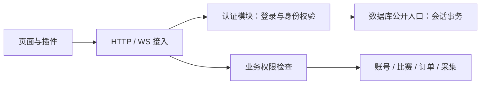

# 用户认证模块边界

认证是独立的一层，负责“当前请求属于哪个用户、哪个会话”。changmen 在同一后端进程中使用独立认证模块，不需要为此增加服务进程。账号归属、管理员权限、下注与订单规则由各业务模块负责。

## 服务端

| 模块 | 路径 | 职责与边界 |
|---|---|---|
| 身份核心 | `server/backend/core/auth/identity.js` | Cookie/JWT → userId、sessionId、loginEpoch、credentialType；依赖注入，不导入业务路由或场馆 |
| 登录用例 | `core/auth/login_service.js` | 参数、限流、证书、登录事务、Cookie；资料和用户策略钩子由应用注入；不导入 account 或 esport-api |
| Client_* 接入 | `core/auth/request_auth.js` | 身份转换与统一错误语义；对业务提供用户上下文 |
| HTTP 接入 | `core/auth/http_identity.js`、`web_session_routes.js` | 请求凭证、Origin/CSRF、公开会话与退出；原生登录处理函数由 HTTP 装配层注入 |
| WS 接入 | `core/auth/realtime_auth.js` | 共享身份校验；频道授权函数作为独立导出，由 Hub 调用 |
| 持久化适配 | `server/db/rds/auth_store.js`、`auth_session_store.js` | 登录与撤销事务、摘要存储、期限和登录代次；只能由 `@changmen/db` 公开入口访问 |
| 应用装配 | `core/esport-api/router.ts`、`http_routes.js` | 注入业务策略和 profile/presence 钩子，保留原 Client_Login 包络；不在路由中实现登录算法 |
| 权限策略 | `action_permissions.js`、`admin_auth.js`、业务 owner 检查 | 与凭证验证分开；权限失败不代表用户退出 |

`core/auth` 内的 HTTP/WS 文件是适配器，允许读取公开 DB/profile 接口；身份核心本身不直接查询数据库。业务模块消费身份，认证核心不操作玩家账号、订单或比赛。

## 前端

| 模块 | 职责 |
|---|---|
| `lib/authSessionState.ts` | 公开 Cookie 身份与 checking/authenticated/anonymous/unavailable 状态 |
| `lib/authSession.ts` | 令牌兼容存储、登录代次、跨标签页变更、会话清理和请求鉴权头；不导入通用 API 或业务 store |
| `lib/webSession.ts` | 原生会话探测、恢复与退避；直接消费认证状态模块 |
| `lib/authCredentials.ts` | 外部 relay/SDK 按需获取短期 JWT；长任务绑定发起时的登录代次 |
| `lib/jwtRefresh.ts`、`sessionRefresh.ts` | 旧 Client_RefreshToken 的兼容接入；HTTP 调用属于协议适配，不进入账号/下注业务 |
| `api/auth.ts`、`runtime/sessionRecovery.ts` | 登录/退出协议与页面启动装配 |
| `api/client.ts` | Client_* HTTP 包络；兼容重导出原认证函数，已有业务 import 保持有效。认证状态不再实现在此文件中 |

无需立即修改所有历史 import；兼容导出与独立状态模块共享同一实例，不存在两套登录态。后续新增认证代码直接导入 `lib/authSession`，业务 API 使用现有 client 接口。

## 强制边界

`npm run check:boundaries` 已增加规则：身份核心/登录用例不得导入 account、esport-api、场馆或 proxy；认证 HTTP/WS 适配器不得反向导入业务路由；前端会话核心不得导入 api/client、业务 store 或组件。

不改变 GitHub master 的账户存储、ACCOUNT 调用时序、订单和下注算法。短期凭证过期可续期；业务写请求的网络失败不能自动重放。配置变更、部署与数据库故障不应被包装成普通“未登录”。

## 用户证书

证书管理是独立模块 `core/certificates`，签发、登记和吊销只能由管理员后台调用。认证层经 `@changmen/db.authorizeClientCertificate` 验证指纹对应的不可变 userId；业务权限判断仍由各业务模块承担。表结构、兼容和部署顺序见 [用户证书模块](CLIENT_CERTIFICATES.md)。
